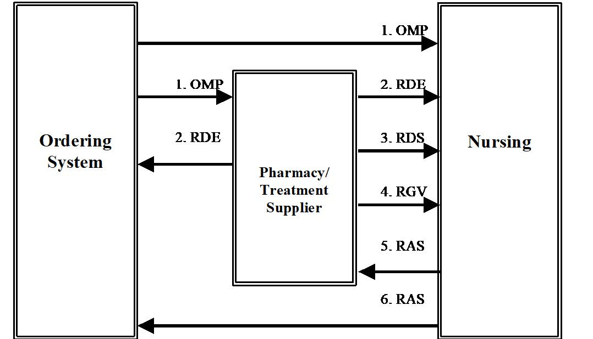

= Pharmacy

== Introduction
[v291_section="4A.3"]

=== Usage Notes for Pharmacy/Treatment Messages

For the RDS (pharmacy/treatment dispense), RGV (pharmacy/treatment give) and RAS (pharmacy/treatment administration) messages, the placer and filler order numbers are those of the parent RDE (pharmacy/treatment encoded order) message. In these messages, the filler order number does not provide a unique identification of the instance of the pharmacy/treatment action (dispense, give or administer). To correct this problem, each of the defining segments (RXD, RXG, and RXA) has an appropriately named sub-ID field (dispense sub-ID counter, give sub-ID counter, and administration sub-ID counter). The combination of the filler order number (including its application ID component) and the appropriate sub-ID counter uniquely identifies the instance of the pharmacy/treatment action(s) present in these messages.

Although the default order control code for the RDE, RDS, RGV and RAS messages is "RE," there are cases in which the pharmacy or treatment system and the receiving system must communicate changes in state. Depending on whether the pharmacy or treatment supplier's relationship to the receiving system is that of placer or filler, the appropriate order control code may be substituted for the default value of RE. The receiving system can also use an appropriate order control code to report status back to the pharmacy or treatment system.

For example, suppose that a pharmacy or treatment system is sending RGV messages to a nursing system which will administer the medication and that the pharmacy or treatment system needs to request that several instances of a give order be discontinued. To implement this request, the RGV message may be sent with a "DC" order control code (discontinue request), and the appropriate RXG segments whose give sub-ID fields identify the instances to be discontinued. If a notification back to the pharmacy or treatment supplier is needed, the nursing system can initiate an RGV message with a "DR" order control code (discontinue as requested), and containing RXG segments whose give sub-ID fields identify the discontinued instances.

=== IV Solution Groups

An order for a group of IV solutions to be given sequentially can be supported in two similar ways: Parent/Child and Separate Orders. This HL7 Standard supports both methods of ordering. The method used at a particular site must be negotiated between the site institution and the various application vendors. 

== General Use Cases / Background
[v291_section="4A.6+"]

Pharmacy/Treatment Transaction Flow Diagram

The following are possible routes at a generic site.

=== OMP

The Ordering application generates a pharmacy/treatment OMP and sends it to the pharmacy or treatment application, Nursing application, and/or other applications as appropriate at the site.

=== RDE

The pharmacy/treatment application may send the RDE, the Pharmacy/Treatment Encoded Order message, a fully encoded order to the Nursing application, Ordering application, and/or other system applications as appropriate at the site.

=== RDS

The pharmacy/treatment application may send the RDS, the Pharmacy/Treatment Dispense message, to the Nursing application or other applications as appropriate at the site, each time a medication is dispensed for this order. This message may occur multiple times for each order.

=== RGV

The pharmacy application may send the RGV, the Pharmacy/Treatment Give message, to the Nursing application or other applications as appropriate at the site, for each scheduled date/time of administration of a medication for a given order. This message may occur multiple times for each order.

=== RAS

The Nursing application (and other applications) can generate the RAS, the pharmacy/treatment Administration Results message, whenever a medication is given to the patient. This message may occur multiple times for each order.

NOTE: Sites having a long term clinical data repository may wish to route data to the data repository from copies of all or any of the five messages.

== Technical Specs

FIX ME - MISSING THE EVEN NUMBERED EVENTS (WHICH ARE TYPICALLY APPLICATION LEVEL ACKS)

xref:technical_specs/O09.adoc[Message - O09 Pharmacy/Treatment Order]

xref:technical_specs/O11.adoc[Message - O11 Pharmacy/Treatment EncodedOrder]

xref:technical_specs/O13.adoc[Message - O13 Pharmacy/Treatment Dispense]

xref:technical_specs/O15.adoc[Message - O15 Pharmacy/Treatment Give Instructions]

xref:technical_specs/O17.adoc[Message - O17 Pharmacy/Treatment Administration]

xref:technical_specs/O25.adoc[Message - O25 Pharmacy/Treatment Refill Authorization Request]

xref:technical_specs/O49.adoc[Message - O49 Pharmacy/Treatment Dispense Request]

xref:technical_specs/O59.adoc[Message - O59 Pharmacy/Treatment Dispense Receipt]

xref:technical_specs/Q11_K31.adoc.adoc[Message - Q11/K31 Pharmacy Query/Response]
