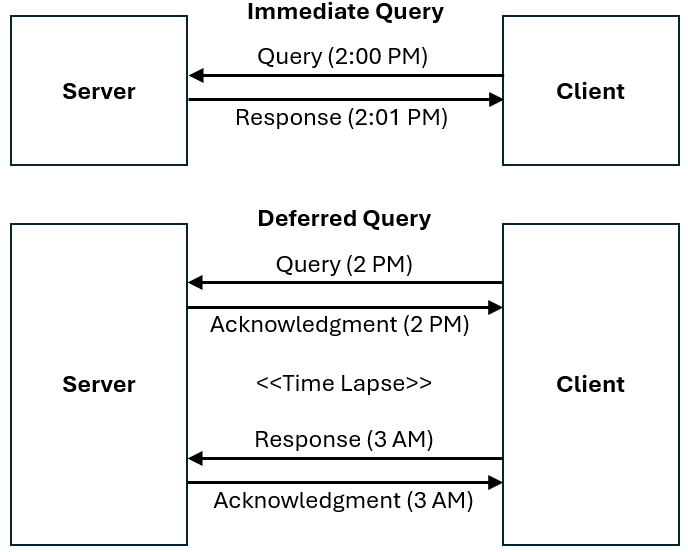

= Queries

== Introduction
[v291_section="5.2"]

This topic defines the rules that apply to queries and to their responses. 

The standard embraces the most common queries that are likely to occur. The following represents typical examples of queries that may be supported by the standard:

* data regarding a single patient, e.g., send all lab results for patient #123456

* data regarding multiple patients, e.g., send the list of patients whose attending physician is Dr. #123

* data that is not patient related, e.g., send the age specific normal values for serum protein.

* data within a specified time range, e.g., send all serum glucose results, reported between January 1, 2024 through December 31, 2024, for patient #123456.

The variety of potential queries is almost unlimited. There was no attempt here to define a standard that would cover every possible query. This topic discusses general ways query/response exchanges are structured. 

In particular, there is no implication that a specific system SHALL support generalized queries or Conformance Statements to comply with the standard. Rather, these transactions provide a format, or a set of tools to support queries to the extent desired by the institution. The resources available and local policies will influence the type of queries that MAY BE implemented.

=== Query/response model
[v291_section="5.2.1"]

A query with its response should be thought of as a message pair. The following illustration shows the three generic models of message pairs: the *_declarative, interrogative,_* and *_imperative_*. Within each model, one system assumes the role of initiator and the other system assumes the role of responder. HL7 queries follow the "interrogative" style of messaging as described below.

image::Query_Figure_1.png[query_response_model]

[NOTE]
All messaging in HL7 assumes a single basic paradigm using a point-to-point transmission of an initial message from a sender to a receiver, followed by a response or acknowledgement message from the receiver back to the sender. The response/acknowledgment message may be optional depending on several use cases that will be discussed below. The point-to-point transmission is defined independent of any particular technology or architecture.

The *_declarative_* model is employed for distribution or broadcast of unsolicited *events* such as the ORU and RDS. *Clients* (*interested parties*) that desire information that resides on a *Server* or *data owner* may "subscribe" to be updated when new information is available on the Server. The Server initiates a transmission of event information. This transmission may be to a single Client, or may be a broadcast to multiple Clients. Each Client responds with an acknowledgement of receipt.

The *_interrogative_* model is employed for queries. A Client initiates a query (a request for data) to the Server. The Server processes the query, responds with a report of success or failure of the query to the Client, and further responds by delivering information requested by the query.

The *_imperative_* model is employed for remote interoperation. A Client initiates a request for action (such as an order) to the Server. The Server processes the request and responds with a report of success or failure to the Client.

[NOTE]
In HL7 v2, there is no formal assumption of client-server architecture, or of a particular "publish and subscribe" architecture. Thus the roles of the intercommunicating applications may change according to the messaging needs. _i.e._, an application may be a data owner or Server for one set of messages (e.g., an order entry system creating orders), and an interested party or Client for another set of messages (e.g., an order entry system receiving order status messages from an ancillary departmental system). Furthermore, the "data owning" system may be a middleware component such as an "application server" or a "messaging gateway" or "router" that distributes information from a server application. In the discussions below, "_Client_" and "_Server_" are used as shorthand synonyms for "requesting system/application" and "responding system/application" without implying the assumption of a client/server architecture. Likewise, the support for "publish and subscribe" does not assume a particular operating system or architecture, but is defined at the application level (level 7), in a technology-neutral form. The phrase "_data owner_" is used to refer to the human institution that operates the Server program. One would say that "the data owner defines the data to be made available by the Server program."

=== Evolution of the query standard
[v291_section="5.2.2"]

The Query Standard, like the HL7 v2 Standard in general, has been evolving since its inception in Version 2.1 with the introduction of a new methodology intended to supersede the previous generation of queries. Throughout the many iterations of the HL7 v2 Standard a wide variety of query modes have been defined, however very little real-world implementation of v2-based queries have been seen. For the purposes of understandability, the current version of this HL7 v2 standard includes only on the query pattern which has achieved widespread real-world usage. Implementers interested in other modes are refered to previous versions of the v2 Standard available on the HL7 Standards-based Product Grid.

=== Query development methodology
[v291_section="5.2.3"]

An institution, or data owner, decides that it would like to make information available via a query. It decides precisely what data will be made available and how it will be offered. Knowing its own data, the data owner will define its query to return one of three representations of the data:

{empty}1) As traditional HL7 segments. 

{empty}2) As rows and columns of data from a precisely defined Virtual Table. 

{empty}3) As rows of human readable text ready to output to a screen or printer. 

[NOTE]
Only the use of traditional HL7 segment queries have achieved widespread usage. The remainder of this topic will focus on this representation of data. Implementers interested in either the rows and columns or human readable text are refered to previous versions of the v2 Standard available on the HL7 Standards-based Product Grid.

Next, the data owner specifies exactly which input variables the Client can use to control the data that the Server agrees to return.

The complete specification of what data are available, how the data will be returned, and what variables can be valued or constrained in a Query is called the Query Profile.

The Query Profile concept is critical to the proper usage of the query/response pair. In the absence of a Query Profile, the Client would be unaware of the existence of the query, let alone how to use it or what to expect from it. The data owner advertises the existence of, and support for, a query by publishing a *_Query Profile_* which is a declaration which sets forth the name of the query supported by the Server, the logical structure of the information that can be queried, and the logical structure of what can be returned. The introduction of the Query Profile concept is not intended to imply system certification. It is intended to promote well-specified queries. As in previous versions, support for queries is not required for HL7 conformance.

The Query Profile has the following broad structure:

* Introduction including title, trigger events, mode, characteristics and purpose
* Query Grammar
* Response Grammar
* Input Specification and Commentary
* Response Control
* Output specifications and Commentary

=== Response Format
[v291_section="5.2.4"]

The first decision a data owner SHALL make in formulating a query is to decide which of the 3 styles of representing data is most appropriate for their needs.  Each query will define, in its Query Profile, the precise grammar of HL7 segments that it will return. 

==== Segment pattern response
[v291_section="5.2.4.1"]

Segment Pattern data responses reflect the traditional way of offering data within HL7. The Server responds to queries by returning a pattern of HL7 segments. For example, the core of a response to a query for Lab data might be defined by the following segment grammar where patient information will be returned in the PID segment and laboratory results in OBR and OBX segments:

{PID 

OBR 

[\{OBX}] 

}

In this style, the message returned by a Server is often a close approximation to an existing unsolicited update HL7 message. In creating a Query Profile for a segment pattern response, the data owner SHALL decide on the exact segment grammar it will return. The output specification of the Query Profile for a segment pattern response will have a structure very similar to the message definition of a standard HL7 transaction. It SHALL define a grammar of segments that will be returned, and, for each segment, it should clarify, where necessary, the meaning of each field, the cardinality of the data, and whether the data is optional or required.

=== Query specification formats
[v291_section="5.2.5"]

The previous section explained the representation of data that are returned to a query client. This section discusses how the client may represent a query for information. HL7 now defines several basic variants for specifying a query.

*_Query by Simple Parameter_*

The first variant is called the Simple Parameter query. In the simple parameter query, the input parameters are passed in order as successive fields of a QPD segment. The Server need only read them from the corresponding QPD fields, and plug them into an internal function to evaluate the query.

This is the most basic form of the query in which the Server specifies a fixed list of parameters in its Query Profile. (For example, the Server may direct the querying system to specify a medical record number, a beginning date, and an ending date.) When invoking the query, the Client passes a specific value for each parameter. This is analogous to invoking a stored procedure against a database.

The obvious implementation gain is that the Server can simply map the input values to the parameters specified in the Query Profile. An already known function or procedure is called to evaluate the query and select data to be returned. The bulk of the work effort has already been invested in the development of this predefined function or procedure.

*_Query by Example Variant:_*

The Query by Example (QBE) is an extension of Query by Parameter (QBP) in which search parameters are passed by sending them in the segment which naturally carries them, instead of as fields of the QPD segment. For example, if one wanted to perform a "find_candidates" query using QBE, one would send the demographics information on which to search in the PID and/or PD1 segments, leaving blank those fields in the segment sent that are not query parameters. If, for example, religion were not one of the query parameters, PID-17 would be left blank when the PID was sent in the query. Parameters which do not occur naturally in an HL7 message, such as search algorithm, confidence level, etc., would continue to be carried in the QPD segment as they are in the Query by Parameter. The exact segments and fields available for use as query parameters would be specified in the Query Profile for the query.

*_Query Using the QSC Variant:_*

Implementers interested in the more complex QSC variant are refered to previous versions of the v2 Standard available on the HL7 Standards-based Product Grid.

==== Expressing the same data using the variants
[v291_section="5.2.5.1"]

The following is an example of a query stated in both variant forms. This example is presented to illustrate the utility of each format for the purpose of offering a query. The purpose of the query is to allow a simple inquiry upon an administrative database. Suppose a patient information request is submitted by the Client. The Server is to respond with demographic information: patient's date of birth, sex, and ZIP code.

===== Expression as simple parameters
[v291_section="5.2.5.1.1"]

The client system transmits a QBP query message in the following format where QPD-3 has been defined in the Query Profile as the patient's medical record number:

[er7]
MSH|^~\&|FEH.IVR|HUHA.CSC|HUHA.DEMO||199902031135-0600||QBP^Z58^QBP_Q13|1|D|2.8
QPD|Z58^Pat Parm Qry 2|Q502|111069999
RCP|I

The names of the input and output fields are not specified in the query message, but by the Query Profile, identified by _QPD-1-message query name_. The _MSH-9.2-trigger event_ and the _QPD-1-message query name_ are this query's only distinguishing elements. The requesting system SHALL refer to this query's Query Profile to learn more about the input and output fields.

===== Expression as query by example
[v291_section="5.2.5.1.2"]

Just as in the Simple Parameter variant, the Query by Example requires an exact parameter specification. The distinction in a Query by Example is that segments other than QPD are used to transmit the parameters. The segments offered should be already-existing segments that the Server can parse easily.

The client system transmits a Query by Example in the following format where the patient's medical record number is contained in PID-3:

[er7]
MSH|^~\&|FEH.IVR|HUHA.CSC|HUHA.DEMO||199902031135-0600||QBP^Z58^QBP_Q13|1|D|2.8
QPD|Z58^Pat Parm Qry 2|Q502
PID|1||111069999
RCP|I

Parameters used in this query are specified in the Query Profile.

=== Acknowledgment Choreography
[v291_section="5.2.7"]

As of Version 2.9 Infrastructure and Messaging requires that Acknowledgment Choreography be explicitly specified in MSH-15 and MSH-16. Because of the nature of the Query and Response Messaging pattern, the Response message is always an Application Acknowledgment. To specify this, the value in MSH-16 SHALL always be “AL” to indicate that there will always be an Application Acknowledgment to the Query Message. See Chapter 2 for more details on this subject.

== General Use Cases / Background

== QUERY/RESPONSE PROFILE
[v291_section="5.3"]

A *Query Profile* is a declaration which sets forth the name of the query supported by the Server, the logical structure of the information that can be queried, and the logical structure of what can be returned. The introduction of the Query/Response Profilefootnote:[Formerly known as the Conformance Statement, this artifact will be referred to throughout the rest of this document as the *Query Profile* to distinguish it from an implementor assertion of conformance to a particular profile. The Query Profile is understood to include the definition of the appropriate response message(s).] concept is not intended to imply system certification. It is intended to promote the definition and implementation of well-specified queries. As in previous versions, support for queries is not required for HL7 v2 conformance.

In the introduction of a Query Profile, the data owner describes the data being made available and the purpose of the query. The data owner specifies the exact coded value for the Query Name which the Client SHALL use to invoke this query.

The Query Grammar defines the exact segments the Client MAY send. For each field of those segments, the Query Profile SHALL define how the Server will interpret client values. (For example, the patient name field is interpreted as a regular expression match.)

The Response Grammar defines the exact pattern of segments that the Server will return. Each Segment Pattern Response will specify its own pattern of segments. (For example, lab data queries will return patterns of OBR and OBX, while demographic queries might respond with patterns of PID, PV1,... segments.) 

Note that in the case of an HL7-defined query, a specific section of the HL7 Standard will define a Query Profile. By contrast, in the case of a site defined query, the Query Profile is written by analysts and programmers of the Server application/system, and is available to the analysts and programmers of the Client application/system.

=== Using the Query Profile
[v291_section="5.3.1"]

Critical to the proper usage of query/response pairs is the Query Profile concept. In the absence of a Query Profile, the Client might not be aware of the existence of a query, or might not know how to use it or what to expect from it. The Server advertises the existence of, and support for, a query by publishing a *_Query Profile*_. The Query Profile identifies the query, specifies what items can be queried and describes what the response will look like.

=== Formal specification of the Query Profile
[v291_section="5.3.2"]

The Query Profile contains the following information:

*_Query Profile ID:_* The unique identifier applying to this query's Query Profile. This value is transmitted as the first component of _QPD-1-Message query name_. 

*_Formal Query Name:_* identifies a unique query or publication, e.g., PharmacyDispenseHistory.

*_Query Trigger:_* identifies the trigger event for the query. Note that more than one Query Profile may map to the same generic trigger event (Q10 through Q15). If a non-generic trigger event is used, it should correspond to exactly one Query Profile. The use of Q for HL7-standard query trigger events is conventional; another letter may be used if the supply of Q triggers is exhausted. The assignment of a trigger event, while mandatory, is intended to facilitate processing rather than to identify a query uniquely. A query is uniquely identified by the value transmitted in _QPD-1-Message query name_. This value SHALL be the same in both the query and response messages, even though the trigger event for the query differs from the trigger event for the response.

*_Response Trigger:_* Identifies the unique trigger event for the response. Note that more than one Query Profile may map to the same generic trigger event (K10 through K15). If a non-generic trigger event is used, it should correspond to exactly one Query Profile. The use of K for HL7-standard response trigger events is conventional; another letter may be used if the supply of K triggers is exhausted.

*_Query Priority:_* Specifies if the query is immediate, deferred or selectable.

*_Query Characteristics:_* Narrative describing general features of the query.

*_Purpose:_* Describes the intent of query.

*_Query Grammar:_* Defines the logical structure of what can be sent by the Client. The structure of this part of the Query Profile is very similar in appearance to a message syntax.

*_Response Grammar:_* Defines the logical structure of what can be returned by the Server. The structure of this part of the Query Profile is very similar in appearance to a message syntax with two additional columns: Comment and Support Indicator.

*_Data Model:_* The logical structure of the information that can be queried. This is not always included in the Query Profile.

*_Input Parameter Field Specification and Commentary:_* Cites the allowable parameters that can be passed to the recipient. The structure of this part of the Query Profile is very similar in appearance to an HL7 Segment Attribute Table with several additional columns: ColName, Key/Search, Sort, MatchOp, SegmentFieldName, and Service Identifier Code. A QPD Input Parameters table and corresponding explanation table is always provided. These tables discuss all the fields of the QPD segment, including _QPD-1-Message query name_ and _QPD-2-Query tag_. If the query is a Query by Example, additional input parameters and explanation tables are provided for all the fields that may be populated in the example segments.

*_Response Control:_* Specifies execution date and time, restrictions on amount of data, and query modality. This is not always included in the Query Profile.

*_Output Specification and Commentary:_* Used for tabular and display response. 

Note that in the case of an HL7-defined query, a specific section of the HL7 standard will define a Query Profile. The existence of a standard Query Profile for any given query does *not* mean that a system SHALL implement this particular query to be conformant to the HL7 Standard. However, systems that do implement the query SHALL follow the specifications as given in the Query Profile.

Sites that wish to offer queries not specified by the Standard may create their own Query Profiles. By contrast to an HL7-standard query, in the case of a site defined query, the Query Profile is written by the Server, and is available to the analysts and programmers of the Client system to enable them to know the exact behavior of the Server.

Input Parameter Specification and Input Field Description and Commentary are always included for the QPD segment. When the Query by Example variant is used, they are provided for the QBE as well. 

For Query Profiles published in the HL7 Standard, each table includes the Query Profile ID in parentheses in the upper left-hand cell. This allows the table to be imported automatically into the HL7 database.

==== Suggested steps for developing a Query Profile
[v291_section="5.3.2.1"]

____
{empty}1) Before composing the Query Profile, express the query in ordinary English sentences.

{empty}2) Transform the query into a mathematical or pseudo-language statement. A syntax such as SQL provides a useful mechanism.

{empty}3) From the pseudo-statement, extract the parameters and the operations upon the parameters.

{empty}4) Advertise the parameters in the Query Profile.

{empty}5) Within the Query Profile, explain the operations that will be performed upon the parameters: relational conjunctions, equality/inequality, etc. Use examples to aid the user in understanding how the query might be invoked in specific instances.
____

==== Query Profile introduction
[v291_section="5.3.2.2"]

The Query Profile begins with a table that summarizes the characteristics and identifying information about the query to which the Query Profile applies.

.Query Profile
[width="100%",cols="39%,61%",options="header",]
|===
|Query Statement ID (Query ID=Znn): |Znn
|Type: |
|Query Name: |
|Query Trigger (= MSH-9): |
|Query Mode: |
|Response Trigger (= MSH-9): |
|Query Characteristics: |
|Purpose: |
|Response Characteristics: |
|Based on Segment Pattern: |
|===

*Query Statement ID*: The unique identifier applying to this Query Profile. This value is transmitted as the first component of _QPD-1-Message query name_.

*Type*: Usually *Query*

*Query Name*: The name corresponding to the identifier in *Query Statement ID*. This value is transmitted as the second component of _QPD-1-Message query name_.

*Query Trigger (= MSH-9)*: The exact value that the Client will transmit in the _MSH-9-Message type_ field of the query message.

*Query Mode*: Whether the query may be sent in *Real time* (including Bolus) or in *Batch*; see section _5.5.6.3_, "_Interactive continuation of response messages_." The value *Both* indicates that both real-time/bolus and batch modes are acceptable.

*Response Trigger (= MSH-9)*: The exact value that the Server will transmit in the _MSH-9-Message type_ field of the response message.

*Query Characteristics*: Particular features of this query. This is free text intended to help the query implementor in selecting among queries.

*Purpose*: The end result that this query is intended to accomplish. Free text.

*Response Characteristics*: Particular features of this response. This is free text intended to help the query implementor in selecting among queries.

*Based on Segment Pattern*: For queries that return a segment pattern response, this is the (non-query response) message type upon which the segment pattern is based.

==== Query grammar
[v291_section="5.3.2.3"]

The Query Profile shows a query grammar. This is a brief model of the segments used in the query message.

FIXME - QBP message definition is missing
[tabset, "QBP^Znn^QBP_Qnn"]

When the Query by Example variant is used, the Query Grammar shows the segments that may be used to transmit parameters and the order in which they appear. Segments used to transmit parameters are always sent immediately following the QPD segment.

==== Response grammar
[v291_section="5.3.2.4"]

The Query Profile always shows a response grammar. If the query response is segment pattern, the response grammar should specify the segments, order, optionality, and repetition as do message specifications within the HL7 v2 Standard.

FIXME - RSP message definition is missing
[tabset, "RTB^Znn^RTB_Knn"]

For Query Profiles published in the HL7 Standard, the Response Grammar table includes the Query Profile ID in parentheses in the upper left-hand cell. This allows the table to be imported automatically into the HL7 database.

==== QPD input parameter specification
[v291_section="5.3.2.6"]

The Input Parameter Specification section of the Query Profile looks very much like an attribute table and is followed by a commentary on the fields. Each row of the QPD Input Parameter Specification specifies one user parameter within the QPD segment. Values for user parameters are transmitted in successive fields of the QPD segment, beginning at QPD-3.

*QPD Input Parameter Specification*
[width="100%",cols="11%,14%,8%,3%,6%,8%,3%,3%,8%,8%,9%,8%,11%",options="header",]
|===
|Field Seq (Query ID=Z99) |Name a|
Key/

Search

|Sort |LEN |TYPE |Opt |Rep |Match Op |TBL |Segment Field Name |Service Identifier Code |Element Name
| | | | | | | | | | | | |
|===

For Query Profiles published in the HL7 Standard, the Input Parameter Specification table includes the Query Profile ID in parentheses in the upper left-hand cell. This allows the table to be imported automatically into the HL7 database.

The following is a description of the attributes of the above table.

*Field Seq*: The ordinal number of the element being discussed. Sequence 1 is [.underline]#always# Message Query Name, and sequence 2 is [.underline]#always# Query Tag. Sequence 3 and above are reserved for user parameters.

*Name*: the user-defined name for the element as will be used in the query. Example: MedicationDispensed. When *Name* is derived from an actual HL7 element (segment and field), the segment field name and element name appear in the columns headed by those names. When *Name* is not derived from an actual HL7 element (segment and field), the source system defines the values they expect in this field.

*Key/Search*: This field identifies which element is the key and which elements are searchable. The key field is designated by a value of 'K'. A value of 'S' designates fields upon which an indexed search can be performed by the source. 'L' designates non-indexed fields. (Note that searching on a non-indexed field requires the Server to perform a linear scan of the data base.) If this column is left blank, the field may not be searched.

*Sort*: valued as "Y" if the output of the query can be sorted on this field. This column should only be valued in Virtual Tables that are used as output specifications.

*Len*: the maximum field length that will be transmitted by the source.

*Type*: the data type of this user parameter. The values available for this field are described in Chapter 2, section 2.16 of this standard. 

*Opt*: defines whether the field is required ('R'), optional ('O'), conditionally required ('C'), or required for backward compatibility ('B').

*Rep*: valued as 'Y' if the field may repeat (i.e., be multiply valued).

*Match Op*: the relational operator that will be applied against the value that the querying system specifies for this field. Note that these are defined by file:///E:\V2\v2.9%20final%20Nov%20from%20Frank\V29_CH02C_Tables.docx#HL70209[_HL7 Table 0209 – Relatio__nal Operator_], a component of the QSC data type

*TBL*: identifies the HL7 table from which the values are derived.

*Segment Field Name*: identifies the HL7 segment and field from which the new definition is derived. This field will be blank if the Name is NOT derived from an actual HL7 segment and field.

*Service Identifier Code:* a value of data type CWE that contains the applicable LOINC code, if it exists, or the applicable HL7 code, if it exists, if no Segment Field Name has been identified. If a Segment Field Name has been identified, this field is not populated.

*Element Name*: the name of the element identified by Segment Field Name. This may also be a user-defined 'Z'-element.

==== QPD input parameter field description and commentary
[v291_section="5.3.2.7"]

The QPD Input Parameter Field Description and Commentary provides a more detailed description of each of the fields transmitted in the QPD segment.
[width="100%",cols="21%,11%,6%,62%",options="header",]
|===
|Input Parameter (Query ID=Znn) |Comp. Name |DT |Description
|MessageQueryName | |CWE |SHALL be valued *Z99^WhoAmI^HL7nnnn*.
|QueryTag | |ST |Unique to each query message instance.
|InputItem... | |CX |
|===

*Input Parameter*: The name of the field whose value is being transmitted.

*Comp. Name*: When the *Input Parameter* is of a composite data type (e.g._,_ XPN), this is the name of an individual component of the composite input parameter. Only those components that may be valued should be listed in this column.

*DT*: The data type of the parameter or component.

*Description*: A narrative description of the parameter or component and how it is to be used.

==== QBE input parameter specification
[v291_section="5.3.2.8"]

In the Query by Example variant the Query Profile may specify that the client may use fields within actual message segments, such as the PID segment, to transmit parameter information. Where this is permitted, the Query Profile includes a "QBE Input Parameter Specification" table to specify which fields may be used to transmit the parameters.

.*QBE Input Parameter Specification*
[width="99%",cols="13%,14%,9%,3%,6%,7%,5%,5%,8%,6%,12%,12%",options="header",]
|===
|Segment Field Name (Query ID=Z99) |Name a|
Key/

Search

|Sort |LEN |TYPE |Opt |Rep |Match Op |TBL |Service Identifier Code |Element Name
| | | | | | | | | | | |
|===

Fields are indicated by their actual Segment Field Name, which specifies both segment and position. Except for this distinguishing feature, the remaining columns in this table are identical in meaning to their counterparts in the "_QPD input parameter specification_" in section _5.3.2.6_ above.

Each row of the QBE Input Parameter Specification specifies one field that may be used to transmit user parameters within the example segment(s).

==== QBE input parameter field description and commentary
[v291_section="5.3.2.9"]

The QPD Input Parameter Field Description and Commentary provides a more detailed description of each of the fields transmitted in the example segments sent in a Query by Example.

.*QBE Input Parameter Field Description and Commentary*
[width="100%",cols="17%,11%,8%,64%",]
|===
|Input Parameter (Query ID=Znn) |Comp. Name |DT |Description
| | | |
|===

Fields are indicated by their actual Segment Field Name, which specifies both segment and position. Except for this distinguishing feature, the remaining columns in this table are identical in meaning to their counterparts in the "_QPD input parameter field description and commentary_" in section _5.3.2.7_ above.

==== RCP input parameter field description and commentary
[v291_section="5.3.2.10"]

The RCP Input Parameter Field Description and Commentary provides a more detailed description of each of the fields transmitted in the RCP (Response Control Parameters) segment.

.*RCP Response Control Parameter Field Description and Commentary*
[width="100%",cols="19%,22%,11%,5%,5%,38%",options="header",]
|===
|Field Seq (Query ID=Znn) |Name |Com­po­nent Name |LEN |DT |Description
| | | | | |
|===

*Field Seq*: The position within the RCP segment that the field occupies.

*Name*: The name of the field whose value is being transmitted.

*Component Name*: When the field referenced by *Name* is of a composite data type (e.g., XPN), this is the name of an individual component of the composite input parameter. Only those components that may be valued should be listed in this column.

*LEN*: The maximum length of the field.

*DT*: The data type of the parameter or component.

*Description*: A narrative description of the parameter or component and how it is to be used.

== QUERY/RESPONSE MESSAGE PAIRS
[v291_section="5.4"]

The query recommended for use in v 2.4 and later is the Query by Parameter (QBP). The query/response message pairs that follow in this section supersede the previous generation of original mode and enhanced queries that are described in previous versions of the HL7 v2 standard.

All queries SHALL have a Query Name. The Query Name field, which is a CWE data type, uniquely identifies a Query Profile.

The QBP allows for several variants in defining the selection criteria.

The first variant, the Query by (Simple) Parameter, is to declare a sequence of one to many HL7 fields. Each of these fields will retain its data type as defined in the original HL7 usage. Each field corresponds to a parameter in the Query Profile.

[NOTE]
It is the responsibility of the Server to declare explicitly the purpose of the query, the meaning of each of the query parameters, and the relationships among the parameters. These declarations are made in the Query Profile.

A second variant, the Query by Example, allows the specification of parameters within actual HL7 segments other than the QPD. For example, the Query Profile might permit the use of the PID segment to transmit specific patient identification parameters. Each such parameter is specified in *the QBE Input Parameter Specification* and *QBE Input Parameter Field Description and Commentary* tables.

The difference in how parameters are passed in each of these variants is as follows:

* Query by Simple Parameter passes each client value to the Server positionally using only the third and successive fields of the QPD segment.

* Query by Example passes parameters using HL7 segments, such as PID, that are defined in the endpoint application chapters. The third and successive fields of the QPD segment also may be used in this variant.

Each generic query has a specific message syntax, a unique trigger event, and a unique message structure. Each generic response also has a specific message syntax, a unique trigger event, and a unique message structure.

There is also a generic message structure, to accommodate the specific detail needed in the Segment Pattern Response. The QBP_Q11 structure supports a Segment Pattern Response and contains the MSH, QPD, RCP, and DSC segments. Its default trigger event is Q11. A standard or site-defined query may use this trigger event or may specify a unique trigger event value in its Query Profile. If a unique trigger event value is chosen for a site-defined query, that value SHALL begin with Z.

The queries may support both immediate and deferred response. This information is carried in the RCP segment along with the execution date and time.

The query definition segment is echoed back in the response. This is particularly important in a continuation situation. Otherwise, the sender might conceivably have to manage a queue of queries.

== AUXILIARY QUERY PROTOCOLS
[v291_section="5.6"]

This section discusses properties of queries that can be described as global properties. These properties enable the Client and Server to deal with timing and sizing issues and to handle exceptions.

=== Immediate vs. deferred response
[v291_section="5.6.1"]

Responses to queries can be either immediate or deferred. In the immediate mode, the responding process gives the response immediately or in a short period during which the requesting process will wait for the response. In the deferred mode, the response is returned asynchronously, as a separate message pair. Also, a time interval for the deferred transaction may be specified.

In the case of immediate mode query, the Server does NOT send a General Acknowledgement (ACK). The acknowledgement of the query is contained within the response message. In the case of deferred mode, the query is acknowledged immediately by an ACK. The Server sends the deferred response at the appropriate time. The Client acknowledges the response with an ACK. In short, the deferred query transaction consists of 2 "round trips."

If an immediate mode query message is malformed, a negative ACK is immediately sent.

Use cases for Deferred Response include:

* Evaluate the query conditions at a certain point in time and then return the response. For example, "At 9 AM tomorrow, evaluate query and return response";

* Produce a large report to be communicated to the Server at an off-peak hour. For example, a response which contains all admissions records for the month to be sent at 4:00 a.m., or a reference lab results listing to be sent at noon. A deferred response can benefit both Server and Client in such cases, especially where the generation, communication, and receipt of segments can all be done at times of otherwise low-volume processing.

If the Query Profile indicates that the Server will support both immediate and deferred responses, then the Client may indicate the desired value of this property by sending it in the _RCP-1 Response priority_ field. If the Server supports only one response type, then the value specified by the Client SHALL agree. The Client indicates that an immediate response is desired by setting _RCP-1-Response priority_ to "I". The Client indicates that a deferred response is desired by setting _RCP-1-Response priority_ to "D".

=== Interactive continuation of response messages
[v291_section="5.6.3"]

The Interactive Continuation Protocol defines the methodology for the intentional transmission of a large query-response payload over multiple HL7 messages. Without this protocol, the response would be returned in a single large logical message. Implementers interested in this protocol are refered to previous versions of the v2 Standard available on the HL7 Standards-based Product Grid.

=== Batch message as a query response
[v291_section="5.6.4"]

The HL7 query also can be used to query for a batch. Implementers interested in this approach are refered to previous versions of the v2 Standard available on the HL7 Standards-based Product Grid.

=== Query error response
[v291_section="5.6.5"]

A query/response error can occur at 3 levels:

* Communication failure (broken connection, timeout)

* Malformed message (message reject)

* Malformed query (application error)

If the application receiving the query detects an error while processing the query, the preferred method of response is to return an Application Error (AE) or Application Reject (AR) condition in the _MSA-1-Acknowledgement code_ of the applicable query response message. Further description of the error code is to be included in _ERR-1-Error code and location_. Note that _MSA-6-Error condition_ is retained for backward compatibility for those applications not using the ERR segment. Thus far, this method is consistent with the methods used elsewhere for reporting errors in acknowledgement messages, irrespective of the type of message being acknowledged. In addition, because this is a query response, it is important to include the QAK segment because it specifies the query tag that will identify the particular query instance that was in error. This is of particular importance where a query response may span more than one message.

The ERR segment supersedes _QAK-2-Query response status_.

There are 3 common situations that can arise in a query error response:

*Situation 1: Malformed Message*

The query message itself is bad. The parser does not get to the actual query content. Something is wrong with the envelope, i.e., the message is malformed.

The only response is a negative ACK message containing the MSH, MSA and the ERR. That is, the Server creates an ACK message with AR in _MSA-1-Acknowledgement code_ in the above sentence. The dialogue is ended.

*Situation 2: Malformed Query*

The query message got to the Server and is legitimate, but the Server cannot process the query for some reason, i.e., the query is malformed.

The Response message indicates a negative acknowledgement and shows the problem in the ERR. The response message contains the MSH, MSA, ERR, QAK and the query defining segment if available. That is, the Server creates an ACK message with AE in _MSA-1-Acknowledgement code_ in the above sentence. The rest of the message is absent.

Note that the continuation (DSC) segment is not sent or, if it is, its continuation pointer field (_DSC-1-Continuation pointer_) is null.

[NOTE]
The use of AE (application error) and AR (application reject) codes in _QAK-2-Query response status_ has been deprecated in favor of the ERR segment.

*Situation 3: No data found*

The query is well formed, but there is no data to be returned by the query. This is not strictly an error condition. This example clarifies the protocol to be followed.

The Response message contains MSH, MSA, QAK, and query defining segment. The QAK would indicate "no records found". The rest of the message is absent, i.e., no blank rows or segments are sent.

[NOTE]
If the responding application successfully processes the query, but is unable to find any qualifying data, this is not an error condition. The responding application returns an Application Accept (AA) in the MSA segment of the query response message, but does not return any data segments. If the QAK segment is being used, the field _QAK-2-Query response_ status is valued with NF (no data found, no errors).

== PUBLISH AND SUBSCRIBE
[v291_section="5.7"]

"Publish and subscribe" refers to the ability of one system, the "Publisher", to offer a data stream that can be sent to recipient systems upon subscription. Implementers interested in this functionality are refered to previous versions of the v2 Standard available on the HL7 Standards-based Product Grid.

== Technical Specs

xref:technical_specs/Q11.adoc[Message - Query by parameter/segment pattern response (events vary)]

== Examples

=== Query by parameter (QBP) / segment pattern response (RSP)
[v291_section="5.9.1"]

==== Dispense history example and Query Profile
[v291_section="5.9.1.1"]

The user wishes to know all the medications dispensed for the patient whose medical record number is "555444222111" for the period beginning 5/31/2024 and ending 5/31/2025. The following QBP message is generated:

[er7]
MSH|^~\&|PCR|Gen Hosp|PIMS||202511201400-0800||QBP^Z81^QBP_Q11|ACK9901|P|2.8||||||||
QPD|Z81^Dispense History^HL7nnnn|Q001|555444222111^^^MPI^MR||20240531|20250531|
RCP|I|999^RD|

The pharmacy system identifies medical record number "555444222111" as belonging to Adam Everyman and locates 4 prescription dispenses for the period beginning 5/31/2024 and ending 5/31/2025 and returns the following RSP message:

[er7]
MSH|^~\&|PIMS|Gen hosp|PCR||202511201400-0800||RSP^Z82^RSP_Z82|8858|P|2.8||||||||
MSA|AA|ACK9901|
QAK|Q001|OK|Z81^Dispense History^HL7nnnn|4|
QPD|Z81^Dispense History^HL7nnnn|Q001|555444222111^^^MPI^MR||20240531|20250531|
PID|||555444222111^^^MPI^MR||Everyman^Adam||19800614|M||C|2101 Webster # 106^^Oakland^CA^94612||^^^^^510^6271111|^^^^^510^6277654|||||343132266|||N|||||||||
ORC|RE||89968665|||||202406121345-0700|||77^Hippocrates^Harold^H^III^DR^MD||^^^^^510^2673600||||||
RXE|1^BID^^20240629|00378112001^Verapamil Hydrochloride 120 mg TAB^NDC |120||mgm||||||||||||||||||||||||||
RXD|1|00378112001^Verapamil Hydrochloride 120 mg TAB^NDC |202406291115-0700|100|||1331665|3|||||||||||||||||
RXR|PO||||
ORC|RE||89968665||||||202406291030-0700|||77^Hippocrates^Harold^H^III^DR^MD||^^^^^510^2673600||||||
RXE|1^^D100^^20020731^^^TAKE 1 TABLET DAILY –GENERIC FOR CALAN SR|00182196901^VERAPAMIL HCL ER TAB 180MG ER^NDC |100||180MG|TABLET SA|||G|||0|BC3126631^CHU^Y^L||213220929|0|202480821|||
RXD|1|00182196901^VERAPAMIL HCL ER TAB 180MG ER^NDC |20240821|100|||213220929|0|TAKE 1 TABLET DAILY –GENERIC FOR CALAN SR||||||||||||
RXR|PO||||
ORC|RE||235134037||||||202409221330-0700|||8877^Hippocrates^Harold^H^III^DR^MD||^^^^^555^555-5001||||||RXD|1|00172409660^BACLOFEN 10MG TABS^NDC|202409221415-0700|10|||235134037|5|AS DIRECTED||||||||||||
RXR|PO||||
ORC|RE||235134030||||||202410121030-0700|||77^Hippocrates^Harold^H^III^DR^MD||^^^^^555^555-5001||||||
RXD|1|00054384163^THEOPHYLLINE 80MG/15ML SOLN^NDC|202410121145-0700|10|||235134030|5|AS DIRECTED||||||||||||
RXR|PO

===== Associated dispense history Query Profile
[v291_section="5.9.1.1.1"]

Query Profile

[width="100%",cols="39%,61%",options="header",]
|===
|Query Statement ID (Query ID=Z81): |Z81
|Type: |Query
|Query Name: |Dispense History
|Query Trigger (= MSH-9): |QBP^Z81^QBP_Q11
|Query Mode: |Both
|Response Trigger (= MSH-9): |RSP^Z82^RSP_Z82
|Query Characteristics: |May specify patient, medication, a date range, and how the response is to be sorted.
|Purpose: |To retrieve patient pharmacy dispense history information from the Server.
|Response Characteristics: |Sorted by Medication Dispensed unless otherwise specified in *SortControl.*
|Based on Segment Pattern: |RDS_O01
|===

The QBP_Q11 message structure and related choreography can be found in link:#qbprsp-query-by-parametersegment-pattern-response-events-vary[5.4.1].

FIXME - the RSP_Z82 message definition is missing

[message-structure, "RSP^Z82^RSP_Z82"]

*Input Parameter Specification*

[width="100%",cols="11%,14%,8%,3%,6%,8%,3%,3%,8%,8%,9%,8%,11%",options="header",]
|===
|Field Seq (Query ID=Z81) |Name a|
Key/

Search

|Sort |LEN |TYPE |Opt |Rep |Match Op |TBL |Segment Field Name |Service Identifier Code |Element Name
|1 |MessageQueryName | | |60 |CWE |R | | | | | |
|2 |QueryTag | | |32 |ST |R | | | | | |
| |PatientList |S |Y |20 |CX |O | | | |PID.3 | |PID-3: Patient Identifier List
| |MedicationDispensed |S |Y |100 |CWE |O | |= | |RXD.2 | |RXD-2: Dispense/Give Code
| |DispenseDate.LL |S |Y |24 |DTM |O | |> +
= | |RXD.3 | |RXD-3: Date/Time Dispensed
| |DispenseDate.UL |S |Y |24 |DTM |O | |< +
= | |RXD.3 | |RXD-3: Date/Time Dispensed
|===

*Input Parameter Field Description and Commentary*

[width="100%",cols="22%,11%,6%,61%",options="header",]
|===
|Input Parameter (Query ID=Z81) |Comp. Name |DT |Description
|*MessageQueryName* | |CWE |SHALL be valued *Z81^Dispense History^HL7nnnn*.
|*QueryTag* | |ST |Unique to each query message instance.
|*PatientList* | |CX |The combination of values for _PatientList.ID, and PatientList.AssigningAuthority,_ are intended to identify a unique entry on the PATIENT_MASTER table. The _PatientList.IdentifierTypeCode_ is useful for further filtering or to supply uniqueness in the event that the assigning authority may have more than one coding system. (The PATIENT_MASTER table contains a constraint that prevents multiple patients from being identified by the same combination of field values.) This PATIENT_MASTER entry will be searched against on the PHARMACY_DISPENSE_TRANSACTION table to retrieve the rows fulfilling the query conditions.
| | | |If this field is not valued, all values for this field are considered to be a match.
| | | |If one PID.3 is specified, only 1 segment pattern will be returned.
| |*ID* |ID |If this field, PID.3.1, is not valued, all values for this field are considered to be a match.
| |*Assigning Authority* |HD |If this field, PID.3.4, is not valued, all values for this field are considered to be a match.
| |*Identifier type code* |CWE |If this field, PID.3.5, is not valued, all values for this field are considered to be a match.
|*MedicationDispensed* | |CWE |If this field is not valued, all values for this field are considered to be a match.
|*DispenseDate.LL* | |DTM |This is the earliest value to be returned for Date/Time Dispensed. If this field is not valued, all values for this field are considered to be a match.
|*DispenseDate.UL* | |DTM |This is the latest value to be returned for Date/Time Dispensed. If this field is not valued, all values for this field are considered to be a match.
|===

