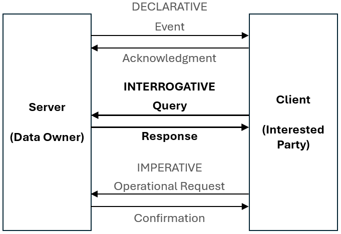

= Queries

== Introduction
[v291_section="5.2"]

This topic defines the rules that apply to queries and to their responses. 

The standard embraces the most common queries that are likely to occur. The following represents typical examples of queries that may be supported by the standard:

* data regarding a single patient, e.g., send all lab results for patient #123456

* data regarding multiple patients, e.g., send the list of patients whose attending physician is Dr. #123

* data that is not patient related, e.g., send the age specific normal values for serum protein.

* data within a specified time range, e.g., send all serum glucose results, reported between January 1, 1998 through December 31, 1999, for patient #123456.

The variety of potential queries is almost unlimited. There was no attempt here to define a standard that would cover every possible query. This topic discusses general ways query/response exchanges are structured. 

In particular, there is no implication that a specific system SHALL support generalized queries or Conformance Statements to comply with the standard. Rather, these transactions provide a format, or a set of tools to support queries to the extent desired by the institution. The resources available and local policies will influence the type of queries that MAY BE implemented.

=== Query/response model
[v291_section="5.2.1"]

A query with its response should be thought of as a message pair. The following illustration shows the three generic models of message pairs: the *_declarative, interrogative,_* and *_imperative_*. Within each model, one system assumes the role of initiator and the other system assumes the role of responder. HL7 queries follow the "interrogative" style of messaging as described below.

[NOTE]
All messaging in HL7 assumes a single basic paradigm using a point-to-point transmission of an initial message from a sender to a receiver, followed by a response or acknowledgement message from the receiver back to the sender. The response/acknowledgment message may be optional depending on several use cases that will be discussed below. The point-to-point transmission is defined independent of any particular technology or architecture.

The *_declarative_* model is employed for distribution or broadcast of unsolicited *events* such as the ORU and RDS. *Clients* (*interested parties*) that desire information that resides on a *Server* or *data owner* may "subscribe" to be updated when new information is available on the Server. The Server initiates a transmission of event information. This transmission may be to a single Client, or may be a broadcast to multiple Clients. Each Client responds with an acknowledgement of receipt.

The *_interrogative_* model is employed for queries. A Client initiates a query (a request for data) to the Server. The Server processes the query, responds with a report of success or failure of the query to the Client, and further responds by delivering information requested by the query.

The *_imperative_* model is employed for remote interoperation. A Client initiates a request for action (such as an order) to the Server. The Server processes the request and responds with a report of success or failure to the Client.

[NOTE]
In HL7 v2, there is no formal assumption of client-server architecture, or of a particular "publish and subscribe" architecture. Thus the roles of the intercommunicating applications may change according to the messaging needs. _i.e._, an application may be a data owner or Server for one set of messages (e.g., an order entry system creating orders), and an interested party or Client for another set of messages (e.g., an order entry system receiving order status messages from an ancillary departmental system). Furthermore, the "data owning" system may be a middleware component such as an "application server" or a "messaging gateway" or "router" that distributes information from a server application. In the discussions below, "_Client_" and "_Server_" are used as shorthand synonyms for "requesting system/application" and "responding system/application" without implying the assumption of a client/server architecture. Likewise, the support for "publish and subscribe" does not assume a particular operating system or architecture, but is defined at the application level (level 7), in a technology-neutral form. The phrase "_data owner_" is used to refer to the human institution that operates the Server program. One would say that "the data owner defines the data to be made available by the Server program."

=== Evolution of the query standard
[v291_section="5.2.2"]

The Query Standard, like the HL7 v2 Standard in general, has been evolving since its inception in Version 2.1 with the introduction of a new methodology intended to supersede the previous generation of queries. Throughout the many iterations of the HL7 v2 Standard a wide variety of query modes have been defined, however very little real-world implementation of v2-based queries have been seen. For the purposes of understandability, the current version of this HL7 v2 standard includes only on the query pattern which has achieved widespread real-world usage. Implementers interested in other modes are refered to previous versions of the v2 Standard available on the HL7 Standards-based Product Grid.

=== Query development methodology
[v291_section="5.2.3"]

An institution, or data owner, decides that it would like to make information available via a query. It decides precisely what data will be made available and how it will be offered. Knowing its own data, the data owner will define its query to return one of three representations of the data:

{empty}1) As traditional HL7 segments. 

{empty}2) As rows and columns of data from a precisely defined Virtual Table. 

{empty}3) As rows of human readable text ready to output to a screen or printer. 

[NOTE]
Only the use of traditional HL7 segment queries have achieved widespread usage. The remainder of this topic will focus on this representation of data. Implementers interested in either the rows and columns or human readable text are refered to previous versions of the v2 Standard available on the HL7 Standards-based Product Grid.

Next, the data owner specifies exactly which input variables the Client can use to control the data that the Server agrees to return.

The complete specification of what data are available, how the data will be returned, and what variables can be valued or constrained in a Query is called the Query Profile.

The Query Profile concept is critical to the proper usage of the query/response pair. In the absence of a Query Profile, the Client would be unaware of the existence of the query, let alone how to use it or what to expect from it. The data owner advertises the existence of, and support for, a query by publishing a *_Query Profile_* which is a declaration which sets forth the name of the query supported by the Server, the logical structure of the information that can be queried, and the logical structure of what can be returned. The introduction of the Query Profile concept is not intended to imply system certification. It is intended to promote well-specified queries. As in previous versions, support for queries is not required for HL7 conformance.

The Query Profile has the following broad structure:

* Introduction including title, trigger events, mode, characteristics and purpose
* Query Grammar
* Response Grammar
* Input Specification and Commentary
* Response Control
* Output specifications and Commentary

=== Response Format
[v291_section="5.2.4"]

The first decision a data owner SHALL make in formulating a query is to decide which of the 3 styles of representing data is most appropriate for their needs.  Each query will define, in its Query Profile, the precise grammar of HL7 segments that it will return. 

==== Segment pattern response
[v291_section="5.2.4.1"]

Segment Pattern data responses reflect the traditional way of offering data within HL7. The Server responds to queries by returning a pattern of HL7 segments. For example, the core of a response to a query for Lab data might be defined by the following segment grammar where patient information will be returned in the PID segment and laboratory results in OBR and OBX segments:

{PID 

OBR 

[\{OBX}] 

}

In this style, the message returned by a Server is often a close approximation to an existing unsolicited update HL7 message. In creating a Query Profile for a segment pattern response, the data owner SHALL decide on the exact segment grammar it will return. The output specification of the Query Profile for a segment pattern response will have a structure very similar to the message definition of a standard HL7 transaction. It SHALL define a grammar of segments that will be returned, and, for each segment, it should clarify, where necessary, the meaning of each field, the cardinality of the data, and whether the data is optional or required.

=== Query specification formats
[v291_section="5.2.5"]

The previous section explained the representation of data that are returned to a query client. This section discusses how the client may represent a query for information. HL7 now defines several basic variants for specifying a query.

*_Query by Simple Parameter_*

The first variant is called the Simple Parameter query. In the simple parameter query, the input parameters are passed in order as successive fields of a QPD segment. The Server need only read them from the corresponding QPD fields, and plug them into an internal function to evaluate the query.

This is the most basic form of the query in which the Server specifies a fixed list of parameters in its Query Profile. (For example, the Server may direct the querying system to specify a medical record number, a beginning date, and an ending date.) When invoking the query, the Client passes a specific value for each parameter. This is analogous to invoking a stored procedure against a database.

The obvious implementation gain is that the Server can simply map the input values to the parameters specified in the Query Profile. An already known function or procedure is called to evaluate the query and select data to be returned. The bulk of the work effort has already been invested in the development of this predefined function or procedure.

*_Query by Example Variant:_*

The Query by Example (QBE) is an extension of Query by Parameter (QBP) in which search parameters are passed by sending them in the segment which naturally carries them, instead of as fields of the QPD segment. For example, if one wanted to perform a "find_candidates" query using QBE, one would send the demographics information on which to search in the PID and/or PD1 segments, leaving blank those fields in the segment sent that are not query parameters. If, for example, religion were not one of the query parameters, PID-17 would be left blank when the PID was sent in the query. Parameters which do not occur naturally in an HL7 message, such as search algorithm, confidence level, etc., would continue to be carried in the QPD segment as they are in the Query by Parameter. The exact segments and fields available for use as query parameters would be specified in the Query Profile for the query.

*_Query Using the QSC Variant:_*

Implementers interested in the more complex QSC variant are refered to previous versions of the v2 Standard available on the HL7 Standards-based Product Grid.

==== Expressing the same data using the variants
[v291_section="5.2.5.1"]

The following is an example of a query stated in both variant forms. This example is presented to illustrate the utility of each format for the purpose of offering a query. The purpose of the query is to allow a simple inquiry upon an administrative database. Suppose a patient information request is submitted by the Client. The Server is to respond with demographic information: patient's date of birth, sex, and ZIP code.

===== Expression as simple parameters
[v291_section="5.2.5.1.1"]

The client system transmits a QBP query message in the following format where QPD-3 has been defined in the Query Profile as the patient's medical record number:

[er7]
MSH|^~\&|FEH.IVR|HUHA.CSC|HUHA.DEMO||199902031135-0600||QBP^Z58^QBP_Q13|1|D|2.8
QPD|Z58^Pat Parm Qry 2|Q502|111069999
RCP|I

The names of the input and output fields are not specified in the query message, but by the Query Profile, identified by _QPD-1-message query name_. The _MSH-9.2-trigger event_ and the _QPD-1-message query name_ are this query's only distinguishing elements. The requesting system SHALL refer to this query's Query Profile to learn more about the input and output fields.

===== Expression as query by example
[v291_section="5.2.5.1.2"]

Just as in the Simple Parameter variant, the Query by Example requires an exact parameter specification. The distinction in a Query by Example is that segments other than QPD are used to transmit the parameters. The segments offered should be already-existing segments that the Server can parse easily.

The client system transmits a Query by Example in the following format where the patient's medical record number is contained in PID-3:

[er7]
MSH|^~\&|FEH.IVR|HUHA.CSC|HUHA.DEMO||199902031135-0600||QBP^Z58^QBP_Q13|1|D|2.8
QPD|Z58^Pat Parm Qry 2|Q502
PID|1||111069999
RCP|I

Parameters used in this query are specified in the Query Profile.

=== Acknowledgment Choreography
[v291_section="5.2.7"]

As of Version 2.9 Infrastructure and Messaging requires that Acknowledgment Choreography be explicitly specified in MSH-15 and MSH-16. Because of the nature of the Query and Response Messaging pattern, the Response message is always an Application Acknowledgment. To specify this, the value in MSH-16 SHALL always be “AL” to indicate that there will always be an Application Acknowledgment to the Query Message. See Chapter 2 for more details on this subject.

== General Use Cases / Background

include::general_use_case_background.adoc[leveloffset=+1]

== Technical Specs

xref:technical_specs/Q11.adoc[Message - Query by parameter/segment pattern response (events vary)]

== Examples

=== Query by parameter (QBP) / segment pattern response (RSP)
[v291_section="5.9.1"]

==== Dispense history example and Query Profile
[v291_section="5.9.1.1"]

The user wishes to know all the medications dispensed for the patient whose medical record number is "555444222111" for the period beginning 5/31/2024 and ending 5/31/2025. The following QBP message is generated:

[er7]
MSH|^~\&|PCR|Gen Hosp|PIMS||202511201400-0800||QBP^Z81^QBP_Q11|ACK9901|P|2.8||||||||
QPD|Z81^Dispense History^HL7nnnn|Q001|555444222111^^^MPI^MR||20240531|20250531|
RCP|I|999^RD|

The pharmacy system identifies medical record number "555444222111" as belonging to Adam Everyman and locates 4 prescription dispenses for the period beginning 5/31/2024 and ending 5/31/2025 and returns the following RSP message:

[er7]
MSH|^~\&|PIMS|Gen hosp|PCR||202511201400-0800||RSP^Z82^RSP_Z82|8858|P|2.8||||||||
MSA|AA|ACK9901|
QAK|Q001|OK|Z81^Dispense History^HL7nnnn|4|
QPD|Z81^Dispense History^HL7nnnn|Q001|555444222111^^^MPI^MR||20240531|20250531|
PID|||555444222111^^^MPI^MR||Everyman^Adam||19800614|M||C|2101 Webster # 106^^Oakland^CA^94612||^^^^^510^6271111|^^^^^510^6277654|||||343132266|||N|||||||||
ORC|RE||89968665|||||202406121345-0700|||77^Hippocrates^Harold^H^III^DR^MD||^^^^^510^2673600||||||
RXE|1^BID^^20240629|00378112001^Verapamil Hydrochloride 120 mg TAB^NDC |120||mgm||||||||||||||||||||||||||
RXD|1|00378112001^Verapamil Hydrochloride 120 mg TAB^NDC |202406291115-0700|100|||1331665|3|||||||||||||||||
RXR|PO||||
ORC|RE||89968665||||||202406291030-0700|||77^Hippocrates^Harold^H^III^DR^MD||^^^^^510^2673600||||||
RXE|1^^D100^^20020731^^^TAKE 1 TABLET DAILY –GENERIC FOR CALAN SR|00182196901^VERAPAMIL HCL ER TAB 180MG ER^NDC |100||180MG|TABLET SA|||G|||0|BC3126631^CHU^Y^L||213220929|0|202480821|||
RXD|1|00182196901^VERAPAMIL HCL ER TAB 180MG ER^NDC |20240821|100|||213220929|0|TAKE 1 TABLET DAILY –GENERIC FOR CALAN SR||||||||||||
RXR|PO||||
ORC|RE||235134037||||||202409221330-0700|||8877^Hippocrates^Harold^H^III^DR^MD||^^^^^555^555-5001||||||RXD|1|00172409660^BACLOFEN 10MG TABS^NDC|202409221415-0700|10|||235134037|5|AS DIRECTED||||||||||||
RXR|PO||||
ORC|RE||235134030||||||202410121030-0700|||77^Hippocrates^Harold^H^III^DR^MD||^^^^^555^555-5001||||||
RXD|1|00054384163^THEOPHYLLINE 80MG/15ML SOLN^NDC|202410121145-0700|10|||235134030|5|AS DIRECTED||||||||||||
RXR|PO

===== Associated dispense history Query Profile
[v291_section="5.9.1.1.1"]

Query Profile

[width="100%",cols="39%,61%",options="header",]
|===
|Query Statement ID (Query ID=Z81): |Z81
|Type: |Query
|Query Name: |Dispense History
|Query Trigger (= MSH-9): |QBP^Z81^QBP_Q11
|Query Mode: |Both
|Response Trigger (= MSH-9): |RSP^Z82^RSP_Z82
|Query Characteristics: |May specify patient, medication, a date range, and how the response is to be sorted.
|Purpose: |To retrieve patient pharmacy dispense history information from the Server.
|Response Characteristics: |Sorted by Medication Dispensed unless otherwise specified in *SortControl.*
|Based on Segment Pattern: |RDS_O01
|===

The QBP_Q11 message structure and related choreography can be found in link:#qbprsp-query-by-parametersegment-pattern-response-events-vary[5.4.1].

FIXME - the RSP_Z82 message definition is missing

[message-structure, "RSP^Z82^RSP_Z82"]

*Input Parameter Specification*

[width="100%",cols="11%,14%,8%,3%,6%,8%,3%,3%,8%,8%,9%,8%,11%",options="header",]
|===
|Field Seq (Query ID=Z81) |Name a|
Key/

Search

|Sort |LEN |TYPE |Opt |Rep |Match Op |TBL |Segment Field Name |Service Identifier Code |Element Name
|1 |MessageQueryName | | |60 |CWE |R | | | | | |
|2 |QueryTag | | |32 |ST |R | | | | | |
| |PatientList |S |Y |20 |CX |O | | | |PID.3 | |PID-3: Patient Identifier List
| |MedicationDispensed |S |Y |100 |CWE |O | |= | |RXD.2 | |RXD-2: Dispense/Give Code
| |DispenseDate.LL |S |Y |24 |DTM |O | |> +
= | |RXD.3 | |RXD-3: Date/Time Dispensed
| |DispenseDate.UL |S |Y |24 |DTM |O | |< +
= | |RXD.3 | |RXD-3: Date/Time Dispensed
|===

*Input Parameter Field Description and Commentary*

[width="100%",cols="22%,11%,6%,61%",options="header",]
|===
|Input Parameter (Query ID=Z81) |Comp. Name |DT |Description
|*MessageQueryName* | |CWE |SHALL be valued *Z81^Dispense History^HL7nnnn*.
|*QueryTag* | |ST |Unique to each query message instance.
|*PatientList* | |CX |The combination of values for _PatientList.ID, and PatientList.AssigningAuthority,_ are intended to identify a unique entry on the PATIENT_MASTER table. The _PatientList.IdentifierTypeCode_ is useful for further filtering or to supply uniqueness in the event that the assigning authority may have more than one coding system. (The PATIENT_MASTER table contains a constraint that prevents multiple patients from being identified by the same combination of field values.) This PATIENT_MASTER entry will be searched against on the PHARMACY_DISPENSE_TRANSACTION table to retrieve the rows fulfilling the query conditions.
| | | |If this field is not valued, all values for this field are considered to be a match.
| | | |If one PID.3 is specified, only 1 segment pattern will be returned.
| |*ID* |ID |If this field, PID.3.1, is not valued, all values for this field are considered to be a match.
| |*Assigning Authority* |HD |If this field, PID.3.4, is not valued, all values for this field are considered to be a match.
| |*Identifier type code* |CWE |If this field, PID.3.5, is not valued, all values for this field are considered to be a match.
|*MedicationDispensed* | |CWE |If this field is not valued, all values for this field are considered to be a match.
|*DispenseDate.LL* | |DTM |This is the earliest value to be returned for Date/Time Dispensed. If this field is not valued, all values for this field are considered to be a match.
|*DispenseDate.UL* | |DTM |This is the latest value to be returned for Date/Time Dispensed. If this field is not valued, all values for this field are considered to be a match.
|===

